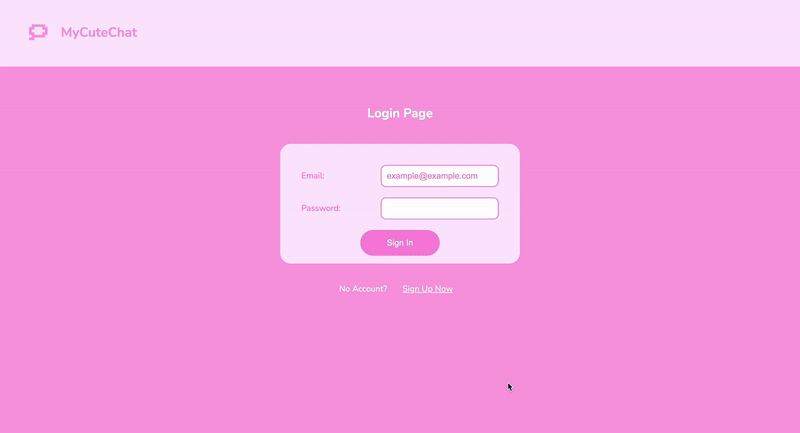

# MyCuteChat 

A small, cute chat app I built to learn more about web sockets and api servers, and ship a full-stack web application.

🩷 The Stack: 

* FrontEnd: **Vite + React + TypeScript**
  
* Backend: 
- **Express + Socket.IO** in the middle,
- **Postgres (Neon) via Prisma** for data,
- **Firebase Auth** for authentication

🩷 Live app: [https://mycutechat.netlify.app](https://mycutechat.netlify.app)  
🩷 API server: [https://chat-app-brok.onrender.com](https://chat-app-brok.onrender.com)

## What it does

- Sign up / sign in with Firebase (ID tokens).  
- Rooms + direct messages (DMs). Messages use a room id for a pair of users.  
- Send/receive messages in real time with Socket.IO.  
- Sidebar updates instantly when you get a new message.  
- All `/api/*` routes require a valid Firebase ID token.  
- Messages + memberships live in Postgres; Prisma manages schema + queries.  

Databse Tables: `User`, `Room`, `Message`, `UserRoom`

## Why I built it

I wanted a hands-on project to practice **full-stack fundamentals**:  
- Structuring a backend API 
- Managing relational data with Prisma + Postgres
- Using Firebase Auth tokens across both frontend and backend
- Deploying a client (Netlify) + server (Render) that work together.

